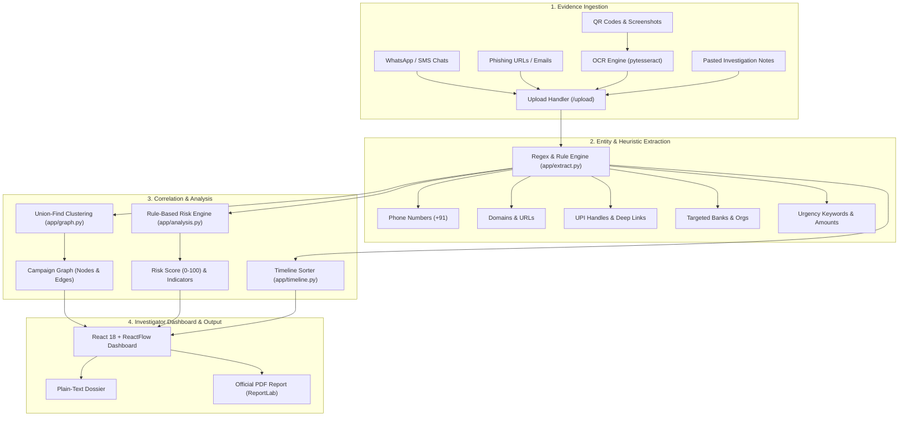

# ScamForensics 🔍🛡️

[](https://fastapi.tiangolo.com/)
[](https://react.dev/)
[](https://vitejs.dev/)
[](https://tailwindcss.com/)
[](https://www.python.org/)
[](https://opensource.org/licenses/MIT)

> **Explainable Multi-Artefact Digital Forensics & Scam Campaign Investigation Platform**  
> Turn disconnected scam artefacts (SMS, WhatsApp chats, phishing URLs, QR codes, and payment slips) into an explainable, linked investigation graph and court-ready forensic report.

---

## 📌 Overview

During a digital fraud incident, victims and investigators are often left with fragmented evidence spread across disparate channels: an SMS lure, a fraudulent WhatsApp chat, a spoofed banking portal, a malicious QR code, and a UPI transaction slip. In isolation, each artefact may appear low-risk or inconclusive.

**ScamForensics** bridges these silos by ingesting multi-modal artefacts, extracting forensic identifiers, clustering related evidence using union-find graph algorithms, computing an explainable 0–100 risk score, reconstructing chronological timelines, and exporting forensic dossiers in both plain text and PDF formats.

> [!NOTE]
> **Investigative Disclaimer**: ScamForensics is an automated decision-support tool. It outputs investigative indicators and confidence scores for investigator review, not definitive legal conclusions.

---

## ✨ Key Features

- **📥 Multi-Modal Evidence Ingestion**:
  - Drag-and-drop or batch upload text files (`.txt`), raw logs, and pasted notes.
  - Image and screenshot support via OCR (`pytesseract` + `Pillow`) with graceful degradation when OCR binaries are unavailable.
  - Automatic classification of evidence types (`whatsapp`, `sms`, `email`, `qr`, `payment`, `url`, `text`).

- **⚡ Forensic Entity Extraction Engine**:
  - Deterministic, high-speed heuristic and regex extraction.
  - Detects Indian phone numbers (`+91`), lookalike domains, UPI handles (`@ybl`, `@oksbi`, `@paytm`, etc.), embedded `upi://pay` QR strings, financial amounts (`₹`, `Rs.`), targeted banking organizations, urgency keywords, and timestamps.

- **🕸️ Interactive ReactFlow Campaign Graph**:
  - Correlates separate pieces of evidence through shared pivot identifiers.
  - Disjoint-set (Union-Find) clustering reveals the primary fraud campaign.
  - Visual distinction with animated edges highlighting shared cross-artefact pivots.

- **📊 Explainable Rule-Based Risk Scoring**:
  - Transparent, auditable scoring model capped at 100 points.
  - Weighted rules account for lookalike domains, KYC lures, urgency language, payment demands, and shared cross-evidence pivots.
  - Severity classification: **HIGH** (≥65), **MEDIUM** (35–64), and **LOW** (<35).

- **⏱️ Chronological Incident Reconstruction**:
  - Extracts and normalizes timestamps from raw messages.
  - Interactive investigator timeline controls allowing manual time adjustments.

- **📄 Multi-Format Dossier Export**:
  - Generates structured investigative dossiers.
  - One-click export to plain text or formatted PDF reports powered by `reportlab`.

- **🤖 Optional AI Narrative Synthesis**:
  - Seamless Anthropic Claude integration (`anthropic` SDK) for concise non-legal narrative summaries.
  - Clean offline fallback ensures 100% functionality without internet or external API keys.

---

## 🏗️ Architecture & Pipeline



---

## 📁 Repository Structure

```text
Opcode/
├── scamforensics/
│   ├── backend/
│   │   ├── app/
│   │   │   ├── __init__.py
│   │   │   ├── main.py          # FastAPI application & REST endpoints
│   │   │   ├── db.py            # SQLite persistence & schema definitions
│   │   │   ├── extract.py       # Regex entity & keyword extraction engine
│   │   │   ├── graph.py         # Union-Find clustering & graph builder
│   │   │   ├── analysis.py      # Rule-based scoring & optional LLM narrative
│   │   │   ├── timeline.py      # Chronological sorting & timestamp normalizer
│   │   │   ├── ocr.py           # Image text extraction via pytesseract
│   │   │   └── report.py        # Plain-text & ReportLab PDF generator
│   │   ├── tests/
│   │   │   └── test_smoke.py    # Automated end-to-end smoke tests
│   │   └── requirements.txt     # Backend Python dependencies
│   ├── frontend/
│   │   ├── src/
│   │   │   ├── components/
│   │   │   │   ├── UploadPanel.jsx  # Evidence dropzone, paste, & demo buttons
│   │   │   │   ├── GraphView.jsx    # Interactive ReactFlow campaign graph
│   │   │   │   ├── RiskPanel.jsx    # Risk badges, metrics, & indicator list
│   │   │   │   ├── Timeline.jsx     # Chronological sequence & time editor
│   │   │   │   └── ReportModal.jsx  # Forensic report preview & PDF download
│   │   │   ├── App.jsx              # Main dashboard application state
│   │   │   ├── api.js               # REST client for backend endpoints
│   │   │   ├── index.css            # Dark-theme cyber-forensics styles
│   │   │   └── main.jsx             # React entry point
│   │   ├── package.json         # Frontend Node dependencies & scripts
│   │   ├── tailwind.config.js   # TailwindCSS configuration
│   │   └── vite.config.js       # Vite development & build setup
│   ├── demo/
│   │   └── evidence/            # 6-artefact "Fake SBI KYC" synthetic test case
│   │       ├── 01_whatsapp.txt
│   │       ├── 02_sms.txt
│   │       ├── 03_email.txt
│   │       ├── 04_qr.txt
│   │       ├── 05_payment.txt
│   │       └── 06_url.txt
│   └── README.md
└── README.md
```

---

## 🚀 Quick Start Guide

### Prerequisites
- **Python**: Version 3.10 or higher
- **Node.js**: Version 18 or higher (with `npm`)
- *(Optional)* **Tesseract OCR**: Required only if extracting text from raw screenshot images.

---

### 1. Backend Setup

Open a terminal and navigate to the backend directory:

```powershell
# Navigate to backend
cd scamforensics\backend

# Create and activate virtual environment
python -m venv .venv

# On Windows (PowerShell):
.\.venv\Scripts\Activate.ps1
# On Linux / macOS:
# source .venv/bin/activate

# Install dependencies
pip install -r requirements.txt

# Start the FastAPI server
uvicorn app.main:app --reload --port 8000
```

The backend API will start at **`http://localhost:8000`**.  
Interactive OpenAPI documentation is available at **`http://localhost:8000/docs`**.

---

### 2. Frontend Setup

Open a second terminal and navigate to the frontend directory:

```powershell
# Navigate to frontend
cd scamforensics\frontend

# Install dependencies
npm install

# Start the Vite development server
npm run dev
```

The UI dashboard will be accessible at **`http://localhost:5173`**.

---

## 🧪 Demo Case Walkthrough

ScamForensics comes pre-configured with a synthetic **6-Artefact "Fake SBI KYC"** fraud investigation to demonstrate cross-channel correlation.

1. Open **`http://localhost:5173`** in your browser.
2. In the left panel, click **Load Demo Case**.
3. The platform ingests 6 synthetic artefacts:
   - `01_whatsapp.txt`: Urgency lure impersonating SBI with phishing domain and phone number.
   - `02_sms.txt`: SMS verification demand referencing the same phone number and domain.
   - `03_email.txt`: Fake bank support email with the same contact numbers.
   - `04_qr.txt`: Fraudulent QR payload (`upi://pay?pa=fraudtest@ybl&am=25000`).
   - `05_payment.txt`: Demanded payment receipt linking back to the fake portal.
   - `06_url.txt`: Threat actor landing page tying the phone and UPI ID together.
4. **Inspect the Results**:
   - **Graph View**: All 6 artefacts cluster into a single campaign node group around shared phone (`+919876543210`), UPI ID (`fraudtest@ybl`), and lookalike domain (`sbi-kyc-verify-example.com`).
   - **Risk Assessment**: Classified as **HIGH Risk (85/100)** with 100% campaign confidence (6/6 connected).
   - **Timeline**: Reconstructed incident progression from 10:21 AM to 10:29 AM.
   - **Report**: Click **Generate Report** to preview the dossier or download `ScamForensics-report.pdf`.

---

## ⚖️ Forensic Risk Scoring Model

The risk assessment engine uses an explainable, additive scoring model capped at 100 points:

| Indicator | Points | Trigger Criteria |
| :--- | :---: | :--- |
| **Look-alike banking domain** | `+25` | Domain contains targeted bank name + suspicious slugs (`kyc`, `verify`, `secure`, `login`) |
| **KYC lure keyword** | `+15` | Text mentions KYC verification or KYC update prompts |
| **Shared cross-evidence identifiers** | `+15` | Phone, UPI, or domain appears across 2 or more distinct artefacts |
| **Payment request** | `+15` | Currency amounts (`₹`, `Rs.`) or direct payment keywords present |
| **QR payment payload** | `+10` | Embedded `upi://pay` deep link or QR payment instructions detected |
| **Urgency / coercive language** | `+10` | Presence of high-pressure words (`urgent`, `blocked`, `suspended`, `immediately`) |
| **Phone number supplied** | `+5` | Extracted valid 10-digit or E.164 phone number |
| **Organisation impersonation** | `+5` | Impersonation of major institutions (SBI, HDFC, ICICI, Axis, Paytm, etc.) |

### Risk Classification Tiers
- 🔴 **HIGH RISK** (`Score ≥ 65`): Strong multi-vector evidence indicating an active coordinated scam campaign.
- 🟡 **MEDIUM RISK** (`35 ≤ Score < 65`): Suspicious indicators present; manual investigator verification recommended.
- 🟢 **LOW RISK** (`Score < 35`): Minimal or isolated suspicious markers detected.

---

## 📡 API Reference

| Method | Endpoint | Description |
| :--- | :--- | :--- |
| `GET` | `/health` | Health check endpoint returning service status. |
| `POST` | `/upload` | Multipart upload for text/images or pasted raw text notes. |
| `GET` | `/evidence` | Retrieve all current evidence items with attached entities. |
| `GET` | `/entities` | Retrieve all extracted entities across the investigation. |
| `PATCH` | `/evidence/{id}/timestamp` | Update manual chronological timestamp for an evidence item. |
| `DELETE` | `/evidence` | Clear all evidence and cascade-delete associated entities. |
| `GET` | `/graph` | Get ReactFlow nodes, edges, clusters, and shared pivots. |
| `GET` | `/timeline` | Get chronologically sorted evidence timeline. |
| `POST` | `/analyze` | Execute risk assessment, clustering, and narrative generation. |
| `GET` | `/report` | Export full case dossier in plain text. |
| `GET` | `/report.pdf` | Generate and download official PDF forensic report. |
| `POST` | `/demo/load` | Reset database and load the 6-artefact Fake SBI KYC demo. |

---

## ⚙️ Configuration & Environment Variables

All core functionality runs completely offline without third-party API keys or paid services. Optional enhancements can be configured in `scamforensics/backend/.env`:

| Variable | Default | Purpose |
| :--- | :--- | :--- |
| `SCAMFORENSICS_DB` | `scamforensics.db` | Path to the SQLite database file. |
| `ANTHROPIC_API_KEY` | *(None)* | Optional Anthropic API key for AI narrative synthesis. |
| `ANTHROPIC_MODEL` | `claude-3-5-haiku-latest` | Model to use if Anthropic enrichment is enabled. |

---

## 🧪 Testing & Verification

Run automated test suites to ensure pipeline integrity:

```powershell
# Run backend pytest suite
cd scamforensics\backend
.\.venv\Scripts\python.exe -m pytest tests\test_smoke.py

# Verify frontend production build
cd ..\frontend
npm run build
```

---

## 🔒 Security, Privacy & Ethical Use

1. **Synthetic Demo Data**: All demo artefacts use synthetic phone numbers, test UPI handles (`fraudtest@ybl`), and non-existent example domains (`sbi-kyc-verify-example.com`).
2. **Local Processing**: Evidence uploaded to ScamForensics is stored in a local SQLite database (`scamforensics.db`) on your machine. No evidence is transmitted to external servers unless an Anthropic API key is explicitly configured.
3. **Forensic Integrity**: Intended for cybersecurity research, law enforcement triage, incident response, and anti-fraud analysis.

---

## 📄 License

This project is licensed under the [MIT License](https://opensource.org/licenses/MIT).
