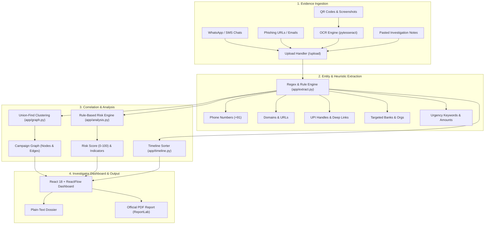

# ScamForensics 🔍🛡️

[](https://fastapi.tiangolo.com/)
[](https://react.dev/)
[](https://vitejs.dev/)
[](https://tailwindcss.com/)
[](https://www.python.org/)
[](https://opensource.org/licenses/MIT)

> **Explainable Multi-Artefact Digital Forensics & Scam Campaign Investigation Platform**  
> Ingests multi-modal scam artefacts (SMS, WhatsApp, emails, QR codes, payment slips), extracts forensic entities, correlates evidence into an interactive campaign graph, calculates explainable risk scores, and exports court-ready dossiers.

---

## 📌 Overview

During a digital fraud incident, victims and investigators are often left with fragmented evidence spread across disparate channels. In isolation, each artefact may appear low-risk or inconclusive.

**ScamForensics** bridges these silos by ingesting multi-modal artefacts, extracting forensic identifiers, clustering related evidence using union-find graph algorithms, computing an explainable 0–100 risk score, reconstructing chronological timelines, and exporting forensic dossiers in both plain text and PDF formats.

> [!NOTE]
> **Investigative Disclaimer**: ScamForensics produces automated forensic indicators and confidence ratings for investigator review, not definitive legal conclusions.

---

## ✨ Key Features

- **📥 Multi-Modal Evidence Ingestion**:
  - Drag-and-drop or batch upload text files (`.txt`), raw logs, and pasted notes.
  - Image and screenshot support via OCR (`pytesseract` + `Pillow`) with graceful degradation when OCR binaries are unavailable.
  - Automatic classification of evidence types (`whatsapp`, `sms`, `email`, `qr`, `payment`, `url`, `text`).

- **⚡ Forensic Entity Extraction Engine**:
  - Deterministic, high-speed heuristic and regex extraction.
  - Detects Indian phone numbers (`+91`), lookalike domains, UPI handles (`@ybl`, `@oksbi`, `@paytm`, etc.), embedded `upi://pay` QR strings, financial amounts (`₹`, `Rs.`), targeted banking organizations, urgency keywords, and timestamps.

- **🕸️ Interactive ReactFlow Campaign Graph**:
  - Correlates separate pieces of evidence through shared pivot identifiers.
  - Disjoint-set (Union-Find) clustering reveals the primary fraud campaign.
  - Visual distinction with animated edges highlighting shared cross-artefact pivots.

- **📊 Explainable Rule-Based Risk Scoring**:
  - Transparent, auditable scoring model capped at 100 points.
  - Weighted rules account for lookalike domains, KYC lures, urgency language, payment demands, and shared cross-evidence pivots.
  - Severity classification: **HIGH** (≥65), **MEDIUM** (35–64), and **LOW** (<35).

- **⏱️ Chronological Incident Reconstruction**:
  - Extracts and normalizes timestamps from raw messages.
  - Interactive investigator timeline controls allowing manual time adjustments.

- **📄 Multi-Format Dossier Export**:
  - Generates structured investigative dossiers.
  - One-click export to plain text or formatted PDF reports powered by `reportlab`.

- **🤖 Optional AI Narrative Synthesis**:
  - Seamless Anthropic Claude integration (`anthropic` SDK) for concise non-legal narrative summaries.
  - Clean offline fallback ensures 100% functionality without internet or external API keys.

---

## 🏗️ Architecture & Pipeline



---

## 🚀 Quick Start Guide

### Prerequisites
- **Python**: 3.10+
- **Node.js**: 18+ (with `npm`)

---

### 1. Start the Backend

```powershell
cd backend
python -m venv .venv

# On Windows:
.\.venv\Scripts\Activate.ps1
# On Linux / macOS:
# source .venv/bin/activate

pip install -r requirements.txt
uvicorn app.main:app --reload --port 8000
```

The API will start at **`http://localhost:8000`** (Swagger docs at `/docs`).

---

### 2. Start the Frontend

In a second terminal:

```powershell
cd frontend
npm install
npm run dev
```

Open your browser at **`http://localhost:5173`**.

---

## 🧪 Demo Case Walkthrough

ScamForensics includes a synthetic **6-Artefact "Fake SBI KYC"** fraud case in `demo/evidence/`:

1. Open **`http://localhost:5173`** and click **Load demo case**.
2. ScamForensics ingests 6 synthetic artefacts across WhatsApp, SMS, email, QR, payment receipts, and phishing landing pages.
3. The platform correlates all 6 artefacts into a single unified cluster around the shared phone (`+919876543210`), UPI ID (`fraudtest@ybl`), and lookalike domain (`sbi-kyc-verify-example.com`).
4. Risk assessment evaluates to **HIGH (85/100)** with 100% campaign confidence.
5. Click **Generate Report** to view the findings and download the official PDF dossier.

---

## ⚖️ Forensic Risk Scoring Model

| Indicator | Points | Criteria |
| :--- | :---: | :--- |
| **Look-alike banking domain** | `+25` | Phishing domain mimicking known bank + `kyc`/`verify`/`login` |
| **KYC lure keyword** | `+15` | Urges urgent KYC validation |
| **Shared identifiers across evidence** | `+15` | Phone, UPI, or domain occurs across ≥2 artefacts |
| **Payment request** | `+15` | Amount demanded or payment keywords |
| **QR payment request** | `+10` | Embedded `upi://pay` link or QR code instructions |
| **Urgency language** | `+10` | Pressure tactics (`urgent`, `blocked`, `suspended`, etc.) |
| **Phone number supplied** | `+5` | Extracted valid phone number |
| **Organisation impersonation** | `+5` | Impersonation of major institutions (SBI, HDFC, etc.) |

---

## 📡 API Reference

| Method | Endpoint | Description |
| :--- | :--- | :--- |
| `GET` | `/health` | Health check and service status |
| `POST` | `/upload` | Ingest files or pasted investigation text |
| `GET` | `/evidence` | Fetch all recorded artefacts with linked entities |
| `GET` | `/entities` | Fetch extracted entities |
| `PATCH` | `/evidence/{id}/timestamp` | Update manual chronological timestamp |
| `DELETE` | `/evidence` | Reset current case evidence |
| `GET` | `/graph` | ReactFlow campaign graph nodes and edges |
| `GET` | `/timeline` | Sorted chronological timeline |
| `POST` | `/analyze` | Execute risk assessment and clustering |
| `GET` | `/report` | Plain-text investigative report |
| `GET` | `/report.pdf` | Downloadable ReportLab PDF dossier |
| `POST` | `/demo/load` | Load the 6-artefact Fake SBI KYC scenario |

---

## 🧪 Verification

```powershell
# Backend smoke tests
cd backend
.\.venv\Scripts\python.exe -m pytest tests\test_smoke.py

# Frontend production build
cd ..\frontend
npm run build
```

---

## 📄 License

This project is licensed under the [MIT License](https://opensource.org/licenses/MIT).
